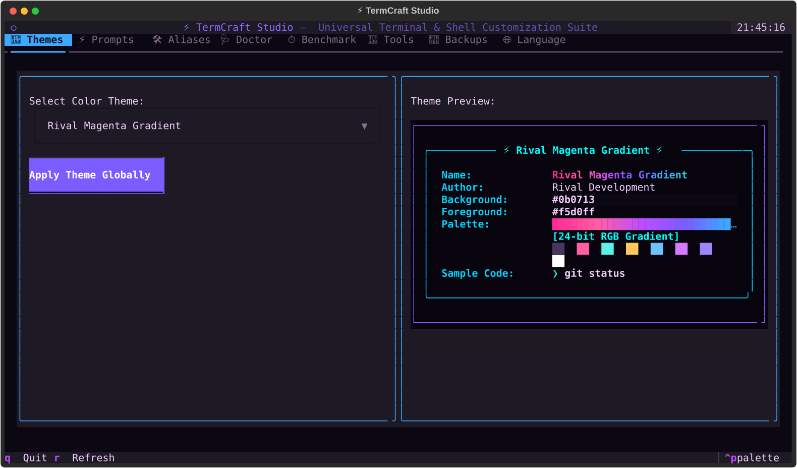
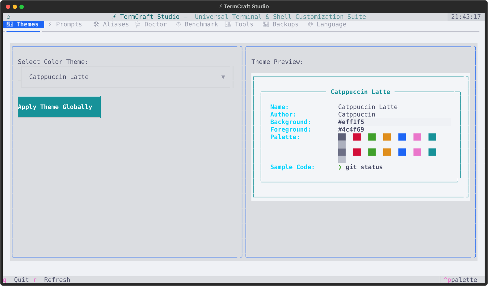
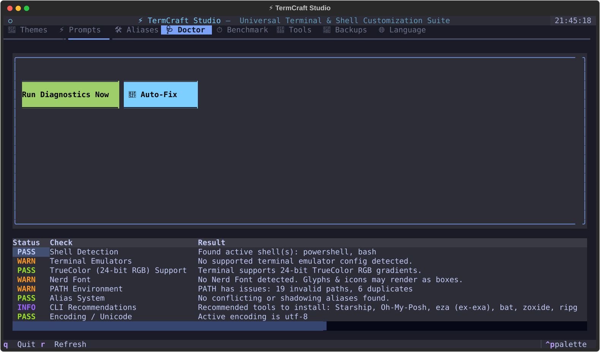
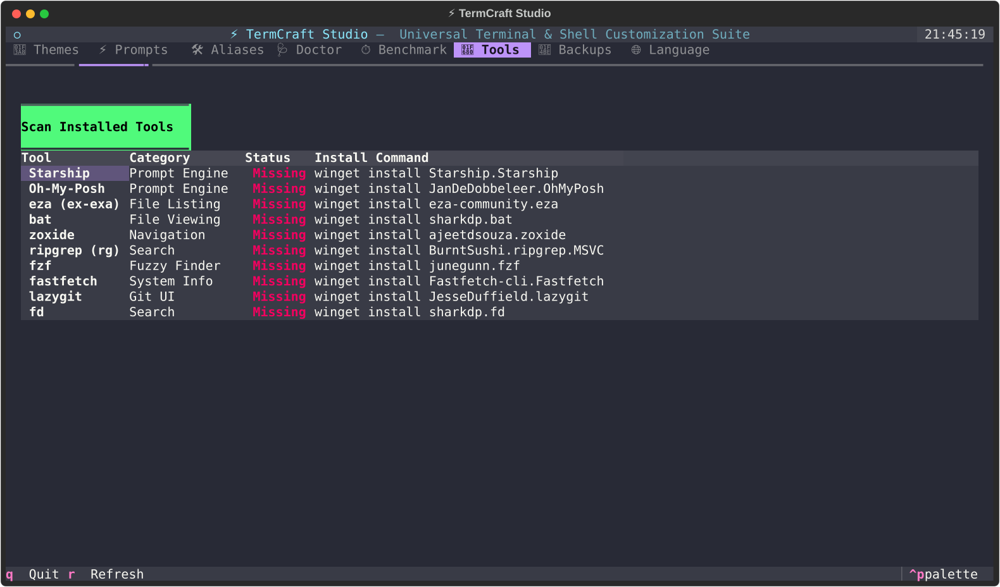
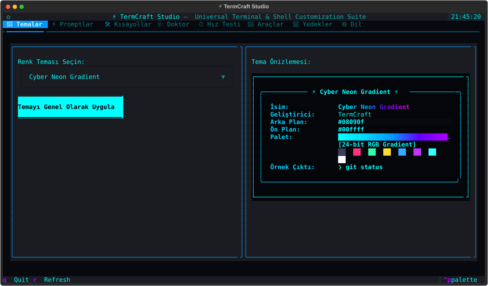

<div align="center">

# ⚡ TermCraft

### *Universal Terminal & CLI Customization, Theming, Profiling and Management Suite*
### *Evrensel Terminal ve Kabuk Özelleştirme, Tema, Hız Analizi ve Yönetim Paketi*

[](https://github.com/adaz-tr/termcraft/actions/workflows/ci.yml)
[](https://www.python.org/)
[](LICENSE)
[](#-supported-shells--terminals)
[](https://textual.textualize.io/)
[](#-türkçe-kullanım-rehberi)

```
  _____                     ____            __ _
 |_   _|__ _ __ _ __ ___   / ___|_ __ __ _ / _| |_
   | |/ _ \ '__| '_ ` _ \ | |   | '__/ _` | |_| __|
   | |  __/ |  | | | | | || |___| | | (_| |  _| |_
   |_|\___|_|  |_| |_| |_| \____|_|  \__,_|_|  \__|
```

**TermCraft** turns a plain command line into a fast, consistent, fully themed developer cockpit — the same colors, aliases and prompt across every shell and terminal emulator you use.



[Features](#-key-features) • [Installation](#-installation) • [Quick Start](#-quick-start) • [Activating](#-activating-it) • [Studio](#-interactive-tui-studio) • [CLI Reference](#-cli-reference) • [Türkçe](#-türkçe-kullanım-rehberi)

---

</div>

## 🌟 Key Features

- **🌈 24-bit RGB gradients** — TrueColor gradient rendering with terminal capability auto-detection and an animated color-cycling banner.
- **🎨 One-command theming** — 23 curated palettes (Rival Magenta, Tokyo Night, Catppuccin Mocha/Latte, Dracula, Nord, Gruvbox, Cyberpunk, Rosé Pine, Synthwave '84, Kanagawa, Everforest, Night Owl …) applied at once to Windows Terminal, Alacritty, WezTerm, Kitty **and** your shell tools (`bat`, `fzf`).
- **⚡ Prompt presets** — instant **Starship** and **Oh-My-Posh** configuration with a live preview before you commit.
- **🛠️ Cross-shell alias manager** — define once, synchronize to PowerShell (`$PROFILE`), Bash, Zsh, Fish and NuShell. Bundled packs for Git, Docker, dev tooling and modern CLI replacements.
- **🚀 CLI tool hub** — detects `eza`, `bat`, `zoxide`, `ripgrep`, `fzf`, `fastfetch`, `lazygit`, `fd`, Starship and Oh-My-Posh, and shows the exact install command for your OS.
- **🩺 Terminal doctor** — checks TrueColor support, Nerd Fonts, broken/duplicate `PATH` entries, UTF-8 readiness, alias shadowing and shell profile integrity.
- **⏱️ Startup profiler** — measures shell launch latency (with a warm-up pass) so you can find the plugin that is costing you 400 ms.
- **💾 Snapshots** — every destructive operation takes an automatic backup first; restore any previous state with one command.
- **🌐 Full i18n** — native Türkçe and English across CLI, diagnostics and TUI.
- **🖥️ Interactive TUI Studio** — full-screen Textual dashboard with live previews, alias tables and mouse support.

---

## 🛡️ Safety by design

TermCraft edits files you care about, so it plays carefully:

- Everything it writes lives between `# >>> termcraft initialize >>>` markers — your own lines are never touched, and `termcraft uninstall` removes the block cleanly.
- `auto_backup` (on by default) snapshots your shell, terminal and prompt configs **before** any theme or prompt is applied.
- Aliases that shadow core commands (`ls`, `cat`, `cd`, `grep`, `find`) are **not** installed by default, and are skipped entirely if the tool they need (`eza`, `bat`, `zoxide` …) is not on your `PATH`.
- WezTerm colors go into a sidecar `termcraft_colors.lua`, and the hook is inserted *before* your final `return config` so the Lua file stays valid.
- Alacritty color tables are replaced rather than appended, so the TOML never ends up with a duplicate `[colors.*]` table.

---

## 💻 Supported Shells & Terminals

| Shells | Terminal Emulators | CLI Tool Sync |
| :--- | :--- | :--- |
| PowerShell (5.1 & Core 7+) | Windows Terminal | `bat` syntax theme |
| Bash (`.bashrc`) | Alacritty (`.toml`) | `fzf` color scheme |
| Zsh (`.zshrc`) | WezTerm (`.lua`) | `starship` config |
| Fish (`config.fish`) | Kitty (`kitty.conf`) | `oh-my-posh` config |
| NuShell (`config.nu`) | | |

---

## 🚀 Installation

### Standalone binary — no Python needed
Grab `termcraft-<platform>` for your OS from the [Releases](https://github.com/adaz-tr/termcraft/releases) page, drop it somewhere on your `PATH`, and run it.

| Platform | File |
| :--- | :--- |
| Windows | `termcraft-windows-amd64.exe` |
| Linux | `termcraft-linux-x86_64` |
| macOS | `termcraft-macos-arm64` |

### From source
Requires Python 3.10+.

```bash
git clone https://github.com/adaz-tr/termcraft.git
cd termcraft
pip install -e .
```

This gives you both the `termcraft` and `tc` commands.

---

## ⚡ Quick Start

```bash
# 1. pick your language
termcraft lang tr

# 2. check what your environment is missing
termcraft doctor

# 3. install the TermCraft block into every detected shell
termcraft init

# 4. apply a theme everywhere at once
termcraft theme apply rival-gradient

# 5. or just do everything visually
termcraft studio
```

---

## 🔌 Activating it

`termcraft init` is the command that wires everything up. It writes one marked block — env vars, aliases and the prompt hook — into every shell profile it detects:

| Shell | File it writes to |
| :--- | :--- |
| PowerShell | `$PROFILE` (both 5.1 and 7 if you have them) |
| Bash | `~/.bashrc` |
| Zsh | `~/.zshrc` |
| Fish | `~/.config/fish/config.fish` |
| NuShell | `config.nu` |

**Nothing changes in your current window.** A shell only reads its profile at startup, so you need to either open a new terminal tab, or reload in place:

```bash
. $PROFILE            # PowerShell
source ~/.bashrc      # Bash
source ~/.zshrc       # Zsh
source ~/.config/fish/config.fish   # Fish
```

Check it worked:

```bash
echo $env:TERMCRAFT_THEME   # PowerShell
echo $TERMCRAFT_THEME       # Bash / Zsh / Fish
```

If that prints your theme name, the block is loading.

### If something doesn't show up

- **Prompt looks plain.** Starship and Oh-My-Posh are not bundled — install one (`termcraft tools list` gives you the command). Without either, TermCraft falls back to a simple built-in prompt so you are never left without one.
- **Icons render as boxes.** You need a Nerd Font, and your terminal has to be set to use it. `termcraft doctor` tells you which ones you have.
- **Nothing at all happens in PowerShell.** Your ExecutionPolicy is probably blocking the profile from loading. Check with `Get-ExecutionPolicy`; if it says `Restricted`, run `termcraft doctor --fix` and say yes when it offers, or set it yourself:
  ```powershell
  Set-ExecutionPolicy -ExecutionPolicy RemoteSigned -Scope CurrentUser
  ```
- **Colors look flat.** Your terminal may not support 24-bit color. `termcraft doctor` checks this.
- **An alias is missing.** Aliases that declare a required tool are skipped when that tool is not installed — this is deliberate, so `ls` and `cd` never break. `termcraft doctor` lists which ones were skipped and why.

### Undoing it

```bash
termcraft uninstall        # removes the block from every shell profile
termcraft backup list      # snapshots taken before each change
termcraft backup restore <snapshot>
```

---

## 🎮 Interactive TUI Studio

```bash
termcraft studio    # or: tc studio
```

| Tab | What it does |
| :--- | :--- |
| 🎨 Themes | Browse palettes with a live syntax-highlight preview, apply globally |
| ⚡ Prompts | Preview Starship / Oh-My-Posh layouts before applying |
| 🛠️ Aliases | Manage shortcuts, load Git/Docker/Dev bundles |
| 🩺 Doctor | Pass/warn diagnostics with auto-fix |
| ⏱️ Benchmark | Startup latency for every installed shell |
| 🚀 Tools | Installed / missing modern CLI tools |
| 💾 Backups | Create and restore snapshots (with confirmation) |
| 🌐 Language | Switch Türkçe ↔ English instantly |

Long-running work (diagnostics, benchmarks, theme apply) runs on background workers, so the UI never freezes. `q` quits, `r` refreshes.

### The studio wears the theme you pick

Selecting a theme recolors the studio itself, not just the preview card — so you see exactly what you are about to apply. Light palettes are handled properly: accent colors are shifted until they meet a WCAG contrast threshold against the panel behind them, so nothing becomes unreadable.

<table>
<tr>
<td width="50%"></td>
<td width="50%"></td>
</tr>
<tr>
<td align="center"><code>rival-gradient</code></td>
<td align="center"><code>catppuccin-latte</code></td>
</tr>
</table>

### Doctor & Tools

<table>
<tr>
<td width="50%"></td>
<td width="50%"></td>
</tr>
<tr>
<td align="center">Diagnostics with pass/warn/info rows</td>
<td align="center">Installed vs missing tools, with install commands</td>
</tr>
</table>

---

## 📖 CLI Reference

### Setup
```bash
termcraft init                 # install the TermCraft block into all detected shells
termcraft uninstall            # remove it again (asks for confirmation)
termcraft lang tr              # tr | en
```

### 🎨 Themes
```bash
termcraft theme list
termcraft theme preview rival-gradient
termcraft theme preview tokyo-night
termcraft theme apply dracula          # terminals + shell tools, backed up first
```

### ⚡ Prompts
```bash
termcraft prompt list
termcraft prompt preview modern-cyber
termcraft prompt apply modern-cyber            # engine auto-detected from the preset
termcraft prompt apply catppuccin-clean        # oh-my-posh preset
termcraft prompt apply modern-cyber -e starship
```

### 🛠️ Aliases
```bash
termcraft alias list
termcraft alias list --cheat

termcraft alias add gco "git checkout" --desc "Checkout branch"
termcraft alias add ls "eza --icons" --requires eza    # skipped if eza is missing
termcraft alias remove gco

termcraft alias bundle git
termcraft alias bundle docker
termcraft alias bundle dev
termcraft alias bundle modern-replacements     # warns about shadowed commands

termcraft alias sync
```

### 🩺 Diagnostics & Benchmark
```bash
termcraft doctor
termcraft doctor --fix                 # refreshes the shell block, asks before touching ExecutionPolicy
termcraft doctor --fix --exec-policy   # non-interactive: also set ExecutionPolicy
termcraft benchmark --iterations 5
```

### 🚀 Tools
```bash
termcraft tools list        # what's installed, what's missing, how to install it
```

### 💾 Backups
```bash
termcraft backup create --tag "my-setup"
termcraft backup list
termcraft backup restore snapshot_my-setup_20260904_230000
termcraft backup restore snapshot_my-setup --yes    # partial name works too
```

### ✨ Banner
```bash
termcraft banner
termcraft banner --animated --loops 2
termcraft banner --palette synthwave-gradient
```

---

## 🗂️ Where things live

```
~/.termcraft/
├── config.yaml        # your profile: theme, prompt, aliases, language
├── backups/           # snapshots (auto + manual)
├── themes/            # drop your own .json / .yaml themes here
└── prompts/           # generated oh-my-posh configs
```

Custom themes are picked up automatically — drop a JSON file with the standard color keys into `~/.termcraft/themes/` and it appears in `termcraft theme list`.

---

## 🇹🇷 Türkçe Kullanım Rehberi

```bash
# dili Türkçe yap
termcraft lang tr

# ortamı tara, eksikleri gör
termcraft doctor

# tüm kabuklara TermCraft bloğunu kur
termcraft init

# görsel stüdyoyu aç
termcraft studio

# renk geçişli temayı önizle ve uygula
termcraft theme preview rival-gradient
termcraft theme apply rival-gradient

# hareketli açılış afişi
termcraft banner --animated

# yedek al / geri yükle
termcraft backup create --tag "kurulumum"
termcraft backup list
termcraft backup restore kurulumum
```



Tüm çıktılar, tanı raporları ve TUI arayüzü Türkçe'ye çevrilidir. Dili değiştirdiğinizde alias açıklamaları da o dilde yeniden üretilir.

**Kurulumdan sonra:** `termcraft init` ayarları kabuk profillerinize yazar ama **açık olan pencerede hiçbir şey değişmez** — kabuk profil dosyasını sadece açılışta okur. Yeni bir sekme açın ya da `. $PROFILE` (Bash'te `source ~/.bashrc`) çalıştırın. Çalıştığını `echo $env:TERMCRAFT_THEME` ile doğrulayabilirsiniz.

PowerShell'de hiçbir şey olmuyorsa büyük ihtimalle ExecutionPolicy profili yüklemeyi engelliyordur; `Get-ExecutionPolicy` `Restricted` diyorsa `termcraft doctor --fix` çalıştırıp sorduğunda onay verin. Prompt sade görünüyorsa Starship veya Oh-My-Posh kurulu değildir (`termcraft tools list` kurulum komutunu verir) — ikisi de yoksa TermCraft kendi basit prompt'una düşer, promptsuz kalmazsınız.

**Güvenlik notu:** TermCraft kabuk profillerinize yazarken sadece kendi işaretli bloğunu değiştirir, sizin satırlarınıza dokunmaz. Tema ve prompt uygulamadan önce otomatik yedek alır. `ls`, `cd`, `cat` gibi temel komutları ezen kısayollar varsayılan olarak kurulmaz; kurulsalar bile ilgili araç sisteminizde yoksa kabuk profiline yazılmaz.

---

## 🤝 Contributing

See [CONTRIBUTING.md](CONTRIBUTING.md). In short: `pip install -e ".[dev]"`, then `pytest` and `ruff check src tests`.

---

## 📄 License

MIT — see [LICENSE](LICENSE).

<div align="center">

**Rival Development - imp0rt**

</div>
